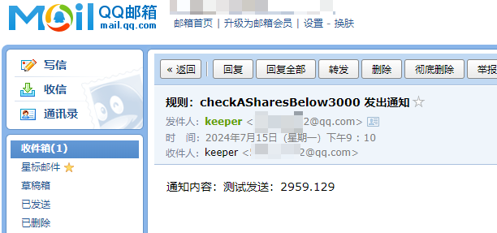
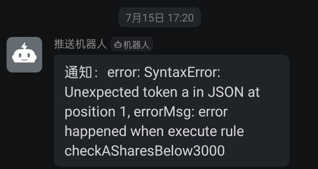

# NotifyEverything 通知万物
帮助你轻松实现各种类型的通知。

简单的定时通知固定内容，或者复杂到多种联合条件成立后发送包含即时信息的通知。它的潜力几乎是无限的！

基于TOML配置，这种格式用过都说好~

# 效果展示

## 当A股跌倒3000点以下时，发送邮件给自己

## 打工仔记得多喝水摸鱼，每天定时提醒你

## 规则运行出问题了，错误可以通知你

# 基本概念

开始之前，你要先了解三个核心概念：资源，通知，规则 

## 简单理解

核心是规则，规则中包含 条件，条件成立则触发通知。条件中包含实时获取的资源，资源类型可以是api或者js脚本。通知基于自己的定义选配。

如果你觉得基本理解了，可以直接看这份 [config_example.toml](config_example.toml)，注释全面，且包含了所有支持的定义。

# 开始使用
点击右侧按钮开始部署：
，直接使用 Github 账号登录即可

...todo